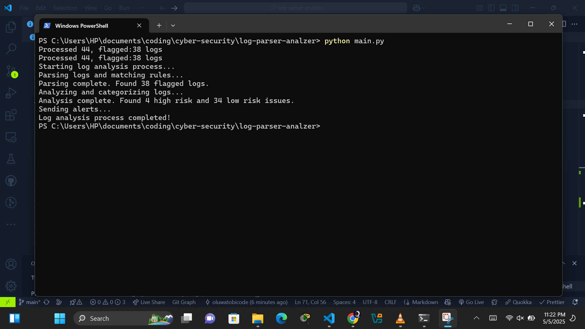
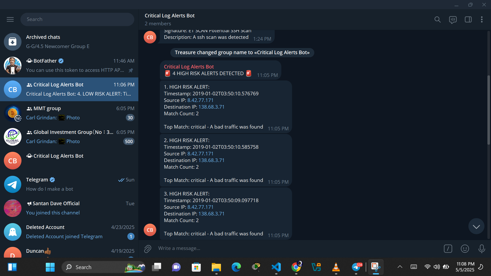

# Log Analyzer Setup and Usage Guide

## Overview

This project is a Python-based Intrusion Detection System (IDS) log parser and analyzer designed to identify and flag suspicious activity from IDS logs (gotten from a public github) like Suricata. It parses logs from a JSON file, compares each entry against a set of custom detection rules (based on fields like severity, category, and signature), and flags matching logs as critical.The flagged logs are then passed to an analyzer for further insight—like detecting recurring patterns or high-risk behavior. For real-time alerting, the system integrates a Telegram bot that sends notifications when specific threats or patterns are detected.Built for learning and practical application in SOC (Security Operations Center) environments, the project promotes hands-on experience in log analysis, threat detection, and basic automation for incident response.

## Project Structure

```
log-analyzer/
├── main.py             # Main script to run the entire analysis pipeline
├── src/                # Source code directory
│   ├── parser.py       # Parses logs and matches against rules
│   ├── analyzer.py     # Categorizes matched logs by risk level
│   └── alerts.py       # Sends Telegram notifications
├── .env                # Environment variables (API keys, etc.)
├── logs/               # Directory containing log files
│   └── alerts-only.json
├── rules/              # Directory containing rule definitions
│   └── ids_rules.json
└── reports/            # Directory for generated report files
    └── report_summary.txt
```

## Setup Instructions

### 1. Environment Setup

First, create a `.env` file in the project root with the following variables:

```
API_TOKEN=your_telegram_bot_token
CHAT_ID=your_telegram_chat_id
```

### 2. How to Get Telegram Bot Token

1. Open Telegram and search for "BotFather"
2. Start a chat with BotFather and send `/newbot`
3. Follow the instructions to create a new bot
4. BotFather will provide you with an API token - copy this to your `.env` file

### 3. How to Get Your Chat ID

1. Start a chat with your bot
2. Send a message to the bot
3. Visit: `https://api.telegram.org/bot<YOUR_API_TOKEN>/getUpdates`
4. Look for the "chat" object and copy the "id" value to your `.env` file

### 4. Install Required Dependencies

```bash
pip install python-telegram-bot python-dotenv
```

## Running the System

1. Make sure your log files are in the `logs/` directory
2. Make sure your rule definitions are in the `rules/` directory
3. Run the main script:

```bash
python main.py
```

This will:

- Parse all logs and match them against rules
- Analyze and categorize logs by risk level
- Send Telegram alerts for high-risk issues
- Generate a written report in the `reports/` directory



## Customizing Alerts

You can modify `alerts.py` to change the format and content of the alerts:

- Adjust the number of detailed alerts sent (currently limited to 5)
- Change the message format and emoji usage
- Add more details from each alert as needed

## Example Telegram Alerts

When high-risk issues are detected, you'll receive alerts like this:



## RESOURCES USED

1. Sample log : `https://github.com/FrankHassanabad/suricata-sample-data/tree/master/samples`
2. Creating enviroment variable : `https://dev.to/jakewitcher/using-env-files-for-environment-variables-in-python-applications-55a1`
3. Sending notifications on telegram: `https://andrewkushnerov.medium.com/how-to-send-notifications-to-telegram-with-python-9ea9b8657bfb`

## FUTURE UPDATES

1. Support other type of logs
2. Make a better rules for different types of logs
